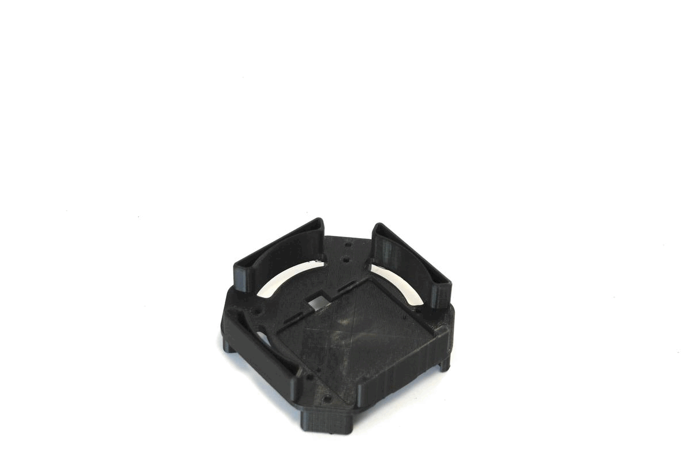

# MAIA

```
███╗   ███╗ █████╗ ██╗ █████╗
████╗ ████║██╔══██╗██║██╔══██╗
██╔████╔██║███████║██║███████║
██║╚██╔╝██║██╔══██║██║██╔══██║
██║ ╚═╝ ██║██║  ██║██║██║  ██║
╚═╝     ╚═╝╚═╝  ╚═╝╚═╝╚═╝  ╚═╝

. ,-"-.   ,-"-. ,-"-.   ,-"-. ,-"-.   ,
 X | | \ / | | X | | \ / | | X | | \ /
/ \| | |X| | |/ \| | |X| | |/ \| | |X|
   `-!-' `-!-"   `-!-' `-!-'   `-!-' `-

╔═╗┬┌┬┐┬ ┬  ╔═╗┌─┐┬┌─┐┌┐┌┌─┐┌─┐       ╔╦╗╦╔╦╗  ╔╦╗┌─┐┌┬┐┬┌─┐  ╦  ┌─┐┌┐
║  │ │ └┬┘  ╚═╗│  │├┤ ││││  ├┤   ───  ║║║║ ║   ║║║├┤  │││├─┤  ║  ├─┤├┴┐
╚═╝┴ ┴  ┴   ╚═╝└─┘┴└─┘┘└┘└─┘└─┘       ╩ ╩╩ ╩   ╩ ╩└─┘─┴┘┴┴ ┴  ╩═╝┴ ┴└─┘

```
Andres Rico - MIT Media Lab - aricom@mit.edu

Modular, low-cost, open source and portable bio reactor for bio sensor testing and deployment.


Ackowledgements:
Laura Gonazalez, Eyal Perry, David Kong, George Church, Joseph Jacobson.

MAIA seeks to become a tool that inspires creativity by enhancing biosensor development for bottom-up citizen sensing applications.

The device is designed to become a tool that can allow for quick experimentation and testing of palsmids 


The design is inspired by LEGO brick's 


MAIA is a low cost bio-reactor that can be used for distributed bio-sensing. The device modularizes bio-reactor fucntions like, temperature and ventialation control to evaluate plasmid design and bio-sensing experiemnts.



