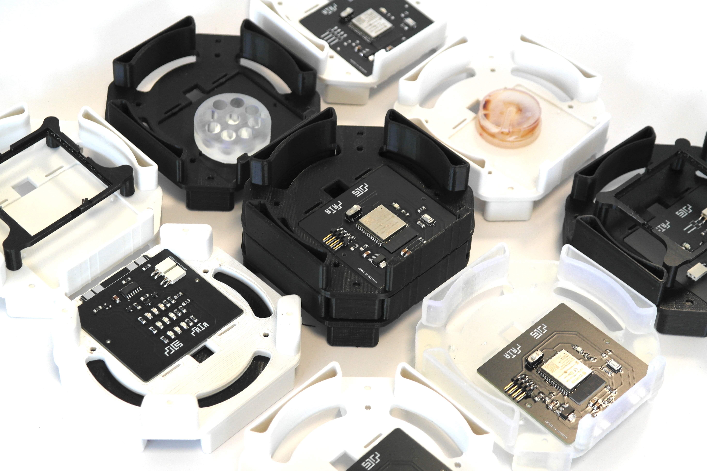
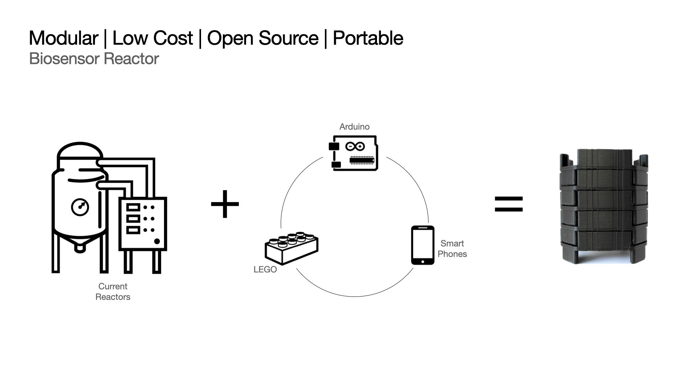
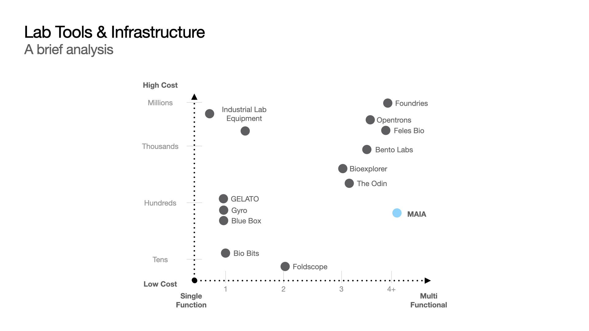
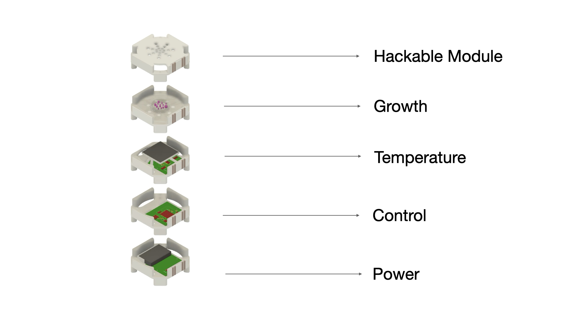
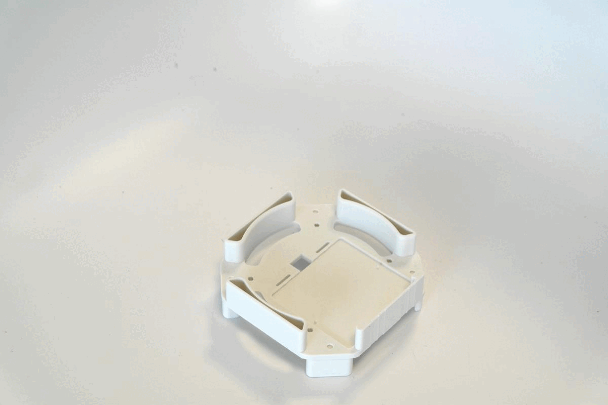

# MAIA

```
███╗   ███╗ █████╗ ██╗ █████╗
████╗ ████║██╔══██╗██║██╔══██╗
██╔████╔██║███████║██║███████║
██║╚██╔╝██║██╔══██║██║██╔══██║
██║ ╚═╝ ██║██║  ██║██║██║  ██║
╚═╝     ╚═╝╚═╝  ╚═╝╚═╝╚═╝  ╚═╝

. ,-"-.   ,-"-. ,-"-.   ,-"-. ,-"-.   ,
 X | | \ / | | X | | \ / | | X | | \ /
/ \| | |X| | |/ \| | |X| | |/ \| | |X|
   `-!-' `-!-"   `-!-' `-!-'   `-!-' `-

╔═╗┬┌┬┐┬ ┬  ╔═╗┌─┐┬┌─┐┌┐┌┌─┐┌─┐       ╔╦╗╦╔╦╗  ╔╦╗┌─┐┌┬┐┬┌─┐  ╦  ┌─┐┌┐
║  │ │ └┬┘  ╚═╗│  │├┤ ││││  ├┤   ───  ║║║║ ║   ║║║├┤  │││├─┤  ║  ├─┤├┴┐
╚═╝┴ ┴  ┴   ╚═╝└─┘┴└─┘┘└┘└─┘└─┘       ╩ ╩╩ ╩   ╩ ╩└─┘─┴┘┴┴ ┴  ╩═╝┴ ┴└─┘

```
Andres Rico - MIT Media Lab - aricom@mit.edu

Modular, low-cost, open source and portable bio reactor for bio sensor testing and deployment.

Ackowledgements:
Laura Gonzalez, Eyal Perry, David Kong, George Church, Joseph Jacobson.



MAIA is a tool that inspires creativity by enhancing biosensor development for bottom-up citizen sensing applications.

The device is designed to be a tool that can allow for quick experimentation and testing of bio-sensor genetic circuits. The lab contributes to a growing ecosystem of the DIY-Bio movement. It provides a modular platform for experimental design and quick iteration based scientific development.

The device borrows characteristics from LEGO bricks to create easy to assemble and interchangeable components. Modules can be stacked and exchanged depending on function and experiment design. The project also integrates the vision of Arduino to motivate hacking and multi purpose use of the device. People can create modules and functionalities that are based on the main architecture design. The designs can be documented and distributed so that many have access to them. Lastly, the reactor brings to bio-reactor and bio-sensor development the benefits that mobile phones brought to computing.



The device is easy to scale because its open source and low cost and can be used for multiple experiments as modules are created and designed specifically for each experiment. The current base structure allows for temperature, ventilation and light tuning.



The device modularizes bio-reactor functions like, temperature and ventilation control to evaluate plasmid design and bio-sensing experiments. The top module of the device can be modified depending on the stimulation that we want to test. We can have experiments that stimulate cultures with sound, vibrations, light. 





