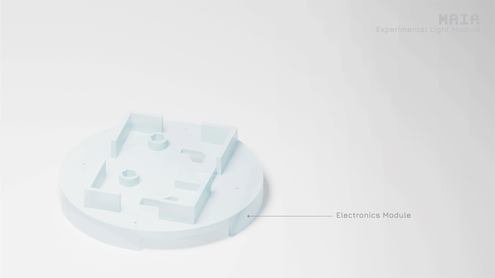

## MAIA - Light Module

 

Laura Maria Gonzalez - lmzalez@mit.edu

### Table of Contents

+ About
+ Mechanical Design
+ Electronic Design
+ Assembly

### About

A light module add on to MAIA for cultivating light sensitive bacteria. Can be combined with agar plate, liquid culture, or *[microfluidics adapter](../fluidics_module/mechanical_design/Fluidics_Adapter.stl)*.

### Mechanical Design
Includes STL files for the *[light module](mechanical_design/Light_Module.stl)* and corresponding *[ventilation module](mechanical_design/Top_Ventilation_Module.stl)*. The light module contains an inset to place the LED PCB and a 1200 mAh lithium battery.

### Electronic Design
Includes files to mill an LED circuit with on/off switch and a JST 2 pin connection to the 1200mAh lithium battery.

### Assembly

 

To assemble, print the two included STL files. On the light module, place the light PCB and connect to the lithium battery placed directly above through the opening. Stack the ventilation module on top and connect the assembly to an adapter plate and the base module.  
