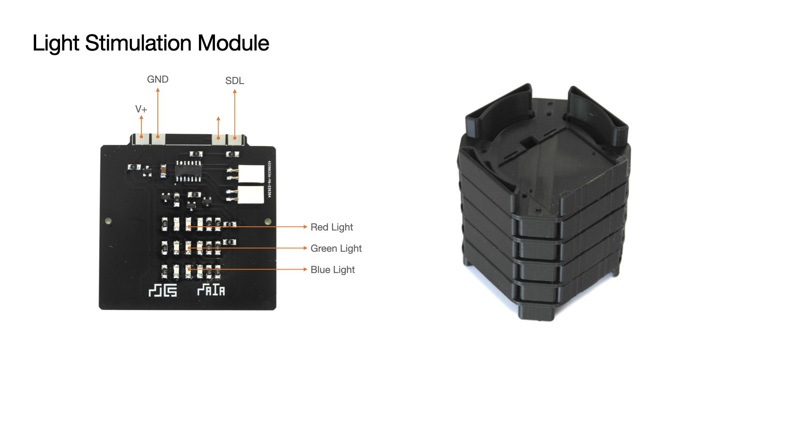

MAIA Light Module

The Module can be used to stimulate bacteria in three different visible wavelengths (Red, Green, Blue).

It is important to note that the modules power anc communication lines are inverted because it is placed on the pcb slot that is at the lower section of the base module structure.

