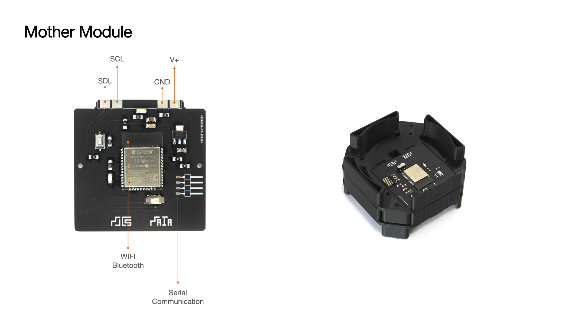

MAIA Mother Module

The Module enables WiFi and Bluetooth communication for the reactor. The module also controls messages sent to other modules and acts a central relay of infromation for the system.

