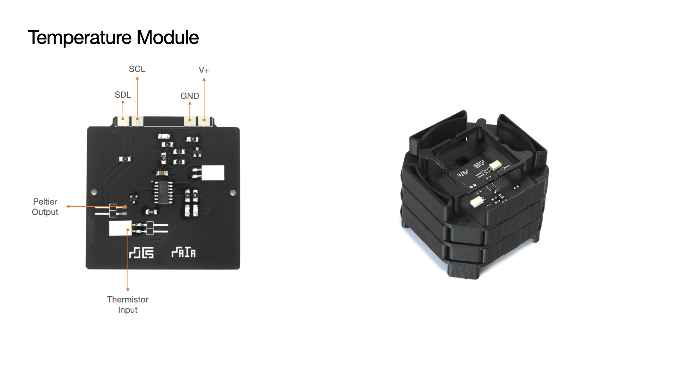

MAIA Temperature Module

The module uses an epoxy thermistor and controls a peltier slip that is in contact with the bacterial culture.
The current version of the module only allows for heating up. The device cools down by deactivating the peltier and having the ambient temperature cool the device down. 

