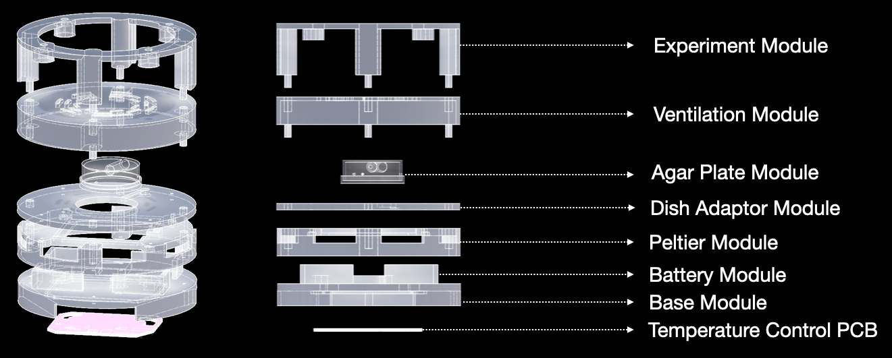

# MAIA

```
███╗   ███╗ █████╗ ██╗ █████╗
████╗ ████║██╔══██╗██║██╔══██╗
██╔████╔██║███████║██║███████║
██║╚██╔╝██║██╔══██║██║██╔══██║
██║ ╚═╝ ██║██║  ██║██║██║  ██║
╚═╝     ╚═╝╚═╝  ╚═╝╚═╝╚═╝  ╚═╝

╔═╗┬┌┬┐┬ ┬  ╔═╗┌─┐┬┌─┐┌┐┌┌─┐┌─┐       ╔╦╗╦╔╦╗  ╔╦╗┌─┐┌┬┐┬┌─┐  ╦  ┌─┐┌┐
║  │ │ └┬┘  ╚═╗│  │├┤ ││││  ├┤   ───  ║║║║ ║   ║║║├┤  │││├─┤  ║  ├─┤├┴┐
╚═╝┴ ┴  ┴   ╚═╝└─┘┴└─┘┘└┘└─┘└─┘       ╩ ╩╩ ╩   ╩ ╩└─┘─┴┘┴┴ ┴  ╩═╝┴ ┴└─┘

```
Andres Rico - MIT Media Lab - aricom@mit.edu

Stl Files for:

Base, Battery, Peltier, Dish Adaptor, Agar Plate & Lid and Ventilation Modules.


